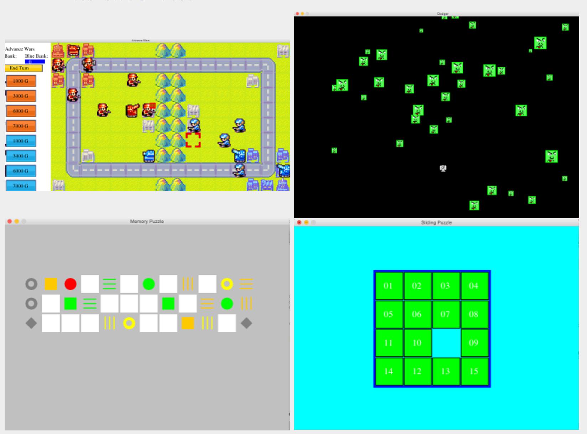

# Game-Clones

These are Java video games I built from scratch without a framework.  The first image of Advance Wars is based on a Gameboy game I played as a kid.  Every tile is configurable to different buildings or terrain.  The terrain affects the movement speed and uses graph search to determine possible movements.  Each tile is one node, and all adjacent nodes are connected by edges.

